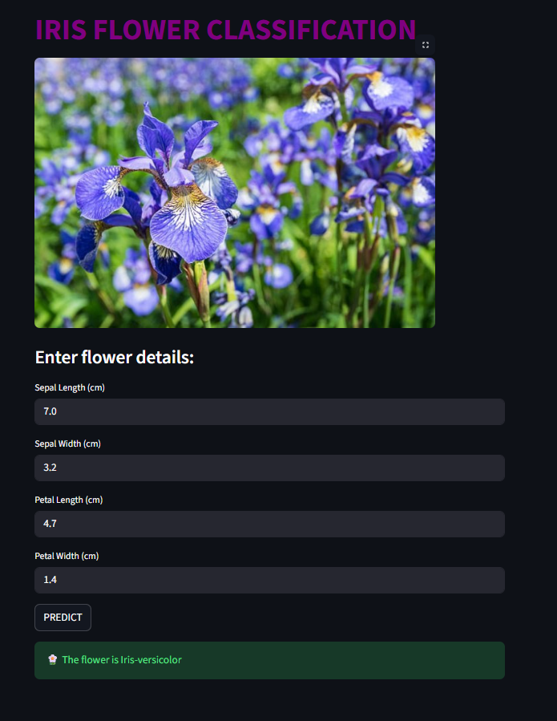

# 🌸 Iris Flower Classification using Streamlit and KNN

This project is a **Streamlit web application** that predicts the type of Iris flower — *Setosa*, *Versicolor*, or *Virginica* — based on four input features.  
The backend uses a **K-Nearest Neighbors (KNN)** classifier trained on the classic **Iris dataset**.

---

## 🚀 Features

- 🧠 Machine Learning model trained using **KNN**  
- 🔢 Input features:
  - Sepal Length (cm)
  - Sepal Width (cm)
  - Petal Length (cm)
  - Petal Width (cm)
- 📊 MinMaxScaler for feature normalization
- 🖼️ Clean, interactive UI built with **Streamlit**
- ✅ Real-time prediction of Iris flower species

---

## 🧩 Project Structure

D:\knn_iris
│
├── iris.py # Streamlit web app
├── retrain_iris_knn.py # Script to train and save model & scaler
├── model_knn.sav # Trained KNN model
├── scaler_knn.sav # Saved MinMaxScaler
├── iris.jpg # Image displayed in the UI
└── README.md # Project documentation

---

## ⚙️ Installation

1. **Clone or copy this project folder**
   ```bash
   git clone https://github.com/your-username/iris-classification.git
   cd iris-classification
Install dependencies

pip install streamlit scikit-learn pillow


(Optional) Retrain the model if needed:

python retrain_iris_knn.py


Run the Streamlit app

streamlit run iris.py


🧠 Model Details

Algorithm: K-Nearest Neighbors (KNN)

Scaler: MinMaxScaler

Dataset: Iris dataset from sklearn.datasets

Accuracy: ~96–98% (depending on random state and split)

🌼 User Interface Preview

The app allows the user to input feature values (using number fields or sliders) and then click "Predict" to see the flower type.

Example:

Feature	Example Value
Sepal Length	5.1
Sepal Width	3.5
Petal Length	1.4
Petal Width	0.2

Prediction: Iris-setosa




🧰 Technologies Used

Python 3.x

Streamlit – for web app UI

Scikit-learn – for model training

Pandas / NumPy – for data handling

PIL (Pillow) – for image display

🧑‍💻 Author

Sreenandh Rajesh
sreenandhrajesh@gmail.com

🌐 LinkedIn
www.linkedin.com/in/sreenandh7
 | GitHub
 https://github.com/orion-prime
